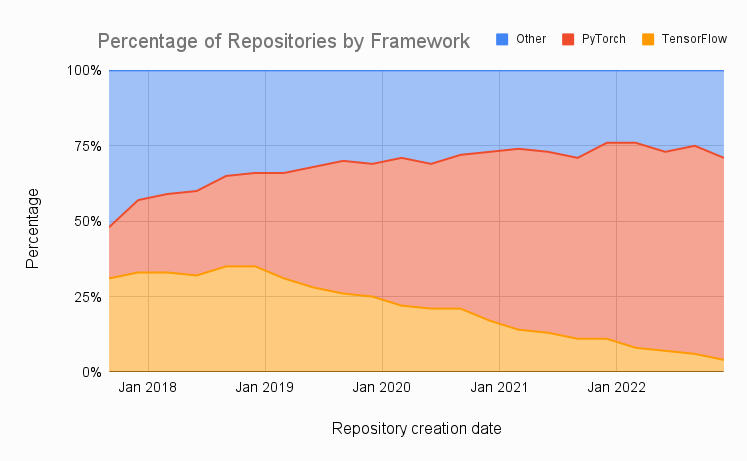
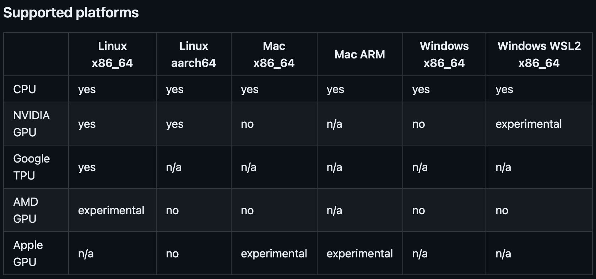
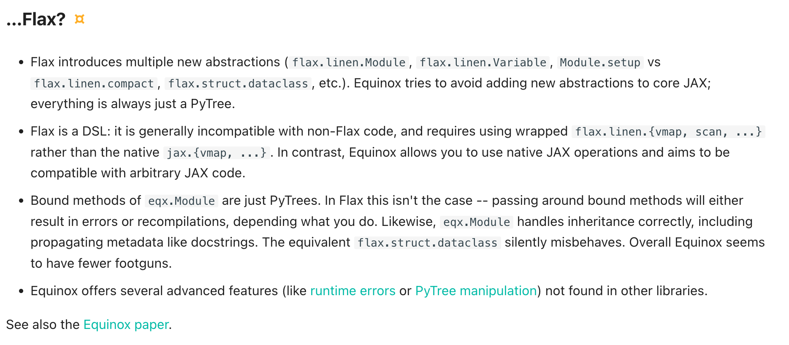

**Assumed audience:** ML researchers who frequently work with `PyTorch`, but are interested in trying out `JAX` or have yet to be convinced.

---

# Introduction

Usually, people start these 'critiques' with a disclaimer that they are not trying to trash the framework, and talk about how it's a tradeoff. However, this is assumed - I'm not going to waste your time with that.

Instead, I'll focus on why PyTorch has been a net negative for all (if not most) scientific computing efforts, causing billions of dollars in lost productivity and thousands of wasted dev-hours.

This is not because its a *bad* framework per-se, but rather - it simply because it wasn't designed for the use-cases it's being employed in right now.

Ever since [LuaTorch](http://torch.ch/), PyTorch was supposed to be a "production ready, easy-to-use framework for quick prototyping". 

It wasn't meant to be deployed onto huge, distributed clusters comprising of thousands of interconnected nodes and GPUs and scale *well* in a fault-tolerant and robust matter.

The guiding philosophy of `Torch` was never about scale - despite what their marketing may have you believe - but *flexibility*.

In response to the rising need of a scalable and performant framework, DeepMind developed `JAX` to meet a simple goal:

> "... Supporting state-of-the-art AI research [by] balancing rapid prototyping and quick iteration with the ability to deploy experiments at a scale ..."  - [`JAX` blogpost](https://arc.net/l/quote/cumgnsor)

This post is about convincing you how important this idea/philosophy is not only for Deep Learning, but for all scientfic computing that needs to happen at scale.

I believe that all infrastructure built on `Torch` is just a huge pile of technical debt, that will haunt the field for a long, long time.

# The Philosophy

PyTorch's philosophy has always, in some ways, been antithetical to that of Tensorflow's.

Where `TF 1.x` tried to be a static but performant framework by making strong use of the `XLA` compiler, `PyTorch` instead focused on being dynamic, easily debuggable and pythonic.

Early on, the TF devs realized their mistakes when they came to realize how much the community hated the old `1.x` API, which was counter-intuitive and introduced anti-pythonic patterns that were difficult to grasp for beginners.

This prompted the core decision to use `Keras` as the main interface for TensorFlow and downplay the role of [`XLA`](https://en.wikipedia.org/wiki/Accelerated_Linear_Algebra) compiler that was at TF's core. The main focus was on cleaning up the frontend as much as possible.

This was a huge mistake.

Sure, the API did improve and worked well for some people - but only as long as your workloads were standard. Any deviations from the norm were punished by stacktrace dumps that were often literal pages of just garbled `XLA-HLO` that were a nightmare to debug unless you had a strong grasp on the internals of the framework/compiler - which you **didn't** because `XLA` was a closed source, internal Google project at the time.

In short, it had every hallmark of a typical Google product.

Thus it comes as no surprise that people who switched over to PyTorch thought they had discovered literal heaven:

<div style="display: flex; flex-direction: row; align-items: center; justify-content: center;">
  <div>
    <blockquote class="twitter-tweet"><p lang="en" dir="ltr">I've been using PyTorch a few months now and I've never felt better. I have more energy. My skin is clearer. My eye sight has improved.</p>&mdash; Andrej Karpathy (@karpathy) <a href="https://twitter.com/karpathy/status/868178954032513024?ref_src=twsrc%5Etfw">May 26, 2017</a></blockquote>
    <script async src="https://platform.twitter.com/widgets.js" charset="utf-8"></script>
  </div>
</div>

PyTorch stuck to its roots. Unlike TensorFlow's static & lazy approach, they took the bolder, more dynamic "eager" approach wherein all `torch.Tensor`s were evaluated immediately, leading to a much more cleaner abstraction than TensorFlow's.

Clearly, they understood that complexity is the enemy of productivity. Instead of tacking on band-aids, they had pursued a fresh new path which paid off.

Unsurprisingly, almost serious research moved to PyTorch:

<figure>
<div class="img-container">

</div>
<figcaption>
PyTorch vs. Tensorflow usage in research repos
</figcaption>
</figure>

But in 2021 [`GPT-3`](https://arxiv.org/abs/2005.14165) hit the scene and suddenly things started getting serious. All of a sudden, performance and scalability became the primary concern. 

`PyTorch` accomodated for this rising demand *decently* well, but because it wasn't designed around this philosophy - slowly the debt starting catching up and the foundations started crumbling. It's hard to reconcile flexibility with performance. Clearly, a tradeoff needed to be made.

Either they could give their biggest and richest users exactly what they wanted - a clean & scalable ecosystem that prioritized performance - which would be a static-oriented `TF`-like design -  or they could try to hold on to what made `Torch` so special in the first place - being dynamic and "eager" at the expense of performance, and somehow delegate those large-scale workloads to an entirely seperate technological stack.

So the devs, being the smart and rational engineers they are, choose an appropriate compromise which was . . . . to pursue both paths simultaneously. 

They were unwilling to make any tradeoffs. They wanted their cake and were going to eat it too.

The new approach was ultimately a chaotic mishmash of competing features. You have on one hand, PyTorch's committment to eventually use *some* compiler (likely `XLA`) as a performant and reliable default backend and on the other, to build up their own entire [`torch.compile`](https://pytorch.org/docs/stable/torch.compiler.html) stack that somehow meshes well with the eager, dynamic philosophy by giving users the freedom to invoke a compiler if need be. 

This lack of real long-term strategy is a serious issue.

Take the `torch.compile` stack and the new [`DTensor`](https://github.com/pytorch/pytorch/blob/main/torch/distributed/_tensor/README.md) API as an example. The documentation is transparent about the inspiration for this feature. It tries to
bring the sharding model of parallelization from `JAX` to `PyTorch`.

> ... When using `DTensor` in a [distributed] fashion it might be ... **slower** compared to existing solutions like DDP/FSDP. This is mainly because DDP/FSDP have a global view of the entire model ... [and can thus] optimize for data parallel specifically ... [whereas] DistributedTensor ... can only optimize within individual tensor operations.

> To improve efficiency of `DTensor`-based data parallel training, we are exploring a **compiler-based** solution on top of `DTensor`.

Leaning on the compiler is diametrically opposed to torch's dynamic philosophy - because at each step, you're restricted by the constraints placed by the compiler which you *must* obey.

`PyTorch` clearly doesn't want to commit to a compiler-centric philosophy (like `JAX`) but I don't see any good alternative solutions - and frankly, I doubt the devs do either.

Instead, what you end up getting getting is a fragmented suite of tools that're barely usable without significant dev-hours sunk in just setting them up and coaxing them to work with each other.

It's considerable friction for research teams who often spend more of their time babysitting the codebase and triangulating random errors rather than running more experiments.

I feel there is a stronger incentive internally on *marketing* and shipping 'features' rather than actually ensuring they integrate well into the ecosystem. It's true that maintaining such a huge ecosystem will always have it's problems, but the considering the case where devs shipped
a built-in implementation of `FSDP`, and it didn't work at *all* with their own `torch.compile` stack for months, really goes to show where their priorities lie.

There is simply no excuse for two of your most core, critical features not working together at all. Users had to wait [weeks](https://dev-discuss.pytorch.org/t/torch-compile-fsdp-dec-8th/1718) before it was officially patched and the bugs were ironed out to the point of it being in a ususable state where is stands now.

My point is that all these failures are systemic due to: a) bad organization and b) bad design decisions.

So what is the competition's solution to this problem?

## Compiler-driven development

`JAX` leverages TensorFlow's formidable compiler stack, [`XLA`](https://en.wikipedia.org/wiki/Accelerated_Linear_Algebra). `XLA` is a pretty powerful compiler, but the beauty is that it's all abstracted away for the end user.
For any function you have, as long as the function is **pure** (more on this later) you can use the simple `@jax.jit` decorator to JIT compile your function and make it available to `XLA`.

You can `jit` any JAX code - `XLA` handles the rest. This is what makes JAX such a great framework for scientific computing - its effectively an eDSL built entirely around `XLA`. The compiler handles and abstracts away a lot of the heavy lifting for us - verifying that the generated graph is correct,
`GSPMD` partitioner that handles the auto-parallelization w/ sharding in JAX, the graph optimizations, operator and kernel fusion, Latency hiding Scheduling, overlapping asynchronous comms, codegeneration to other backends such as [`triton`](https://openai.com/index/triton/) etc.
are all handled by `XLA` behind the scenes.

This is a powerful approach. As long as your code obeys some simple JAX restrictions, `XLA` does this automatically for you. For example, you don't need `torch.distributed.barrier()` and other comms primitives when doing parallelization.
DDP support is as simple as:

```py
# Create a Sharding object to distribute a value across devices:
sharding = PositionalSharding(mesh_utils.create_device_mesh((8,)))   
x = JAX.random.normal(JAX.random.key(0), (8192, 8192))
y = JAX.device_put(x, sharding.reshape(4, 2))
```

which you can also visualize with the built in utilities:
```py
>>> JAX.debug.visualize_array_sharding(z)

+---------------------+
|  TPU 0   |  TPU 1   |
|----------|----------|
|  TPU 2   |  TPU 3   |
|----------|----------|
|  TPU 6   |  TPU 7   |
|----------|----------|
|  TPU 4   |  TPU 5   |
+---------------------+
```

`XLA`'s approach is that computation follows sharding. Therefore, if the input array is sharded across some axis, `XLA` handles that automatically for any downstream computation. No other code changes needed.
No need to add communication collections or anything. `Pytorch` on the other hand requires a ton of boilerplate and modifications just to get a basic DDP setup working correctly.

This idea of "compiler driven development" is similar to how rust's compiler works - helping you write better, cleaner code without worrying about a lot of mundane things.

You focus on the computation, the compiler does the rest.

I believe that comitting to a philosophy gives a framework a certain design skeleton and structure, that can simplify the code and create a smooth and wondeful experience for a developer. 

Which is why I'm unhappy with the choice made by the `PyTorch` devs to integrate and rely on a compiler stack for the cool new features rather than keeping the core philosophy of *flexibility* and *freedom* alive. 

For example, according to the official [roadmap](https://pytorch.org/blog/pytorch-2.0-xla-path-forward/) for `PyTorch` `2.x`, they clearly outline their long-term plans of fully integrating `XLA` with `Torch`:

> "PyTorch/`XLA` is set to migrate to the open source `OpenXLA` as its **default** downstream compiler"

This is an awful idea. It's like saying that shoehorning C++ code in the rust compiler, would somehow be a better experience than using rust itself.

Torch simply wasn't *designed* around `XLA`, unlike `JAX`. The reason `JAX`'s' ecosystem is so much more stable and well-integrated is precisely because they uphold it's core values rather than working around them.

If, god forbid, `Pytorch` does end up going with the plan and commits to an `XLA` based compiler stack, then wouldn't the ideal framework be the one that was *specifically* designed and built around it, as opposed to the one where it has just been crammed in with little thought and care? 

And even **if** `Pytorch` ends up pursuing a 'multi-backend' approach, wherein you would be able choose whatever compiler backend you wish, wouldn't that worsen the fragmentation problem and absolutely nuke the API, as it tries to respect the restrictions of every compiler stack?

This isn't just baseless theorizing either — look at `Torch/XLA`. Anyone who's ever dared to use it on TPUs suffers from a PTSD so severe that they're eligible for benefits. The mere sight of "XLA" sends them into a state of cold sweat and nightmares to the caffeine-fuelled days spent debugging hundred-line `XLA` errors. The only path to recovery at such moments is to reassure the victim that they'll always have their GPUs, and an `A100` may be placed beside them for emotional support.

## Multi-backend is doomed

`Pytorch`'s root problem is that it tries to do everything at once and fails miserably.

The "multi-backend" design decision makes this problem exponentially worse. In *theory*, it sounds like an amazing idea to be able to choose whichever stack you prefer - but in reality, its a tangled mess of obscure tracebacks and incompatibility issues.

It's not that its *hard* to get these backends working. Rather, there are some constraints that these backends expect which are hard to mesh with the flexible and pythonic API of `PyTorch`.

There's a tradeoff between keeping most of the API consistent vs. obeying the restrictions of the backends you leverage. As a result, the devs are seeking to rely more on codegen (say converting torch code to `triton` which then you can manually work with and leverage it's compiler & JIT stack)
as opposed to actually integrating/comitting to a single backend - which is arguably the worse option for `torch`.
 
Every decision `torch` takes somehow always feels like a compromise because it refuses to make meaningful tradeoffs. There's no coherence, no overall strategy. It ends up feeling more like a mishmash of features that don't mesh well together and ultimately cause a lot of frustration for the user.

There is no faster way to kill an ecosystem.

IMHO PyTorch should not follow the `JAX` "integrated compiler and backend" approach for a very simple reason: Jax was explcitly designed from the ground up to work **with** `XLA`. Not **against** it. That is why `TensorFlow` never really took off, and why it's attempts at integrating `Keras` crashed and burned.

Your strategy simply cannot be to just replace the entire `PyTorch` frontend with `JAX`'s, because then you just have a shittier version of `JAX`! It's virtually impossible to come up with a neat, functional API based on `XLA` that's somehow better than `JAX`'s, and carries on `Torch`'s flexible nature.

I don't blame the devs for trying new and different ideas - those are always welcome. However, if they want `PyTorch` to stand the test of time, more focus has to be put in shoring up the foundations than shipping shiny new features that immediately crumble outside ideal tutorial conditions.

## Fragmentation & Functional Programming

`JAX` has a "functional" API. Earlier, I mentioned that `JAX` functions have to be pure (i.e they cannot have any global side effect. Just like mathematical functions, given the same data the function will always return the same output no matter the context of it's execution.)

This design philosophy is what makes `JAX` stand out. Due to the functional roots of `JAX`, `JAX` functions are often composable and interoperate well with each other. It reduces the development complexity as functions are defined with specific signatures and a well-defined,
concrete task. If the types are respected, then the function is guranteed* to work out-of-the-box.

This is well suited to the kinds of workloads that one needs in scientific computing. In Deep Learning especially, since NNs are just a static functions, this functional paradigm makes writing even complex codebases easy.

For example, let's look at the `optax` API from the `JAX` ecosystem.

Due to the functional approach, `optax` has what we call a "chain" that involves a bunch of functions sequentially applied on the gradients. So the fundamental building blocks are `GradientTransformation`s. 

This makes it a really powerful but expressive API to work with.

```py
optimizer = optax.adam(1e-2)
```

If I wanted to clip the grads here for example, I could do it trivially:

```py
optimiser = optax.chain(
    optax.clip_by_global_norm(1.0),
    optax.adam(1e-2),
)
```

If I wanted to do a simple operation such as take the `EMA` of my grads, in PyTorch that would've required setting up objects and then manually digging through the codebases to place methods appropriately.
But with `optax`,

```py
optimiser = optax.chain(
    optax.clip_by_global_norm(1.0),
    optax.adam(1e-2),
    optax.ema(decay=0.999)
)
```

A similar approach goes for combining optimizers, meta-learning approaches, gradient accumulation etc. It's simply much more cleaner than `PyTorch`.

Another cool consequence of a functional design is `vmap`. This stands for 'vectorized' map which accurately describes what it does. You can `map` anything and as long as its a `vmap`, then `XLA` will automatically fuse and optimize it.

This means that when you write functions, you **don't think about the batch dimension!** You just `vmap` all you code and this simplifies things.

For one, you need less `ein-*` ops. While `einops` are great and all - it's simply more intuitive to grasp 2D/3D tensor manipulations, and are also much more readable IMO. Let's take an extremely limited example operation, and compare the difference:

```py
arr: Array = jnp.ones((batch_size, seqlen, h_dim))

def vanilla_func(arr: Array) -> Array:
  '''
  We want to do a: '(b s h, b s h) -> (b s s, b s h) -> b h s' operation.
  '''
  return ((arr @ arr.transpose(0, 2, 1)) @ arr).transpose(0, 2, 1)

@jax.vmap
def vmapped_func(arr: Array) -> Array:
  '''
  We want to do a: '(s h, s h) -> (s s, s h) -> h s' operation.
  '''
  return ((arr @ arr.T) @ arr).T
```

Even for this toy operation, you can immediately see how much more instantly readable the function is. Now imagine that with the more complex tensor manipulations, like the ones used in `MHSA`.

Subscribing to the functional paradigm means that it's easier to write complex code that works *well*, since you only have to reason about individual components in isolation. 
It's both clean and performant because you can `@jax.jit` any pure function without worrying about anything else. It. Just. Works.

In the functional world, as long as you respect the purity constraints and have the right signature, you enjoy all the other benefits - such as composability.

With `torch` however, there is a non-trivial chance that whatever stack you use - say doing `FSDP + multi-node + torch.compile + ...`
something will *always* break due to the sheer complexity involved. Multiple things have to work correctly together, and if any component fails due to edge case, then you would be debugging till 3 a.m. 

And because there would **always** be bugs that weren't caught during development simply because it's not possible to test each and every combination of the dozens of features `Pytorch` offers, It's simply impossible to write code that works well without significant effort.

This has meant that the `torch` ecosystem has become very bloated and buggy - things don't interoperate well together, so contributors often come up with new libraries and frameworks to solve specific issues (like say HuggingFace's `accelerate` for distributed training)
which in turn aren't designed to interface with other such "solutions" due to having no shared abstraction, so it quickly devolves into a mess of dependencies and `requirements.txt` and a training loop that looks like it was the scene of Guido Van Rossum's murder.

I'd go on to say from my anecdotal experience about 70-80% of those GitHub issues or forum discussions are simply due to various libraries erorring out on each other.

Unfortunately, few solutions exist to fix it. This is very much an OOP as well as a design problem. I *think* having a fundamental, `PyTorch`~y object (like `JAX`'s `PyTree`) might've helped build a common base for abstraction, but I'm not an SWE so I'm not sure how much it'd have *really* helped.

Nor can you just adopt a functional programming paradigm, at which point you'd have converged to a worse version of `JAX` while breaking all backwards compatibility for every existing `torch` codebase.

The way I see it - `PyTorch` is well and truly fucked in this department.

## Reproducibility 

The "reproducility crisis" is an oft discussed problem in science, and AI/DL has been no exception. 
Despite the existence of containerized environments and version control, researchers refuse to use them and journals/conferences place no requirements on them either.
Even upholding your pledge to open-source the code isn't verified by academic institutions.

However, there are some design choices that nudge users to write code that facilitates reproduction, with minimal effort. This incentivizes users to put that little effort in 
and gain masive advantages in return - such as being able to validate their older experiments at any point and ensure that randomness is not a factor in any their results.

I believe such oversights are usually because of laziness/carelessness than malicious intent. So such small decisions can ultimately add up to saving potentially dozens of dev-hours and a lot of cussing.

### Seeding

`torch`'s handling of something as simple as seeding is... not ideal. Typically, you'd have to do:

```py
import torch
import numpy as np

np.random.seed(0) # if you're using numpy
torch.manual_seed(0)
torch.cuda.manual_seed_all(args.seed)
torch.use_deterministic_algorithms(True)
torch.utils.deterministic.fill_uninitialized_memory(True)
```

Which let's be honest, isn't really the end of the world coming at barely half a dozen loc - But on the flipside, is easily forgettable/misconfigured especially in the heat of deadlines.

I've personally known researchers who set the seeds in the wrong file at the wrong place and they weren't even used by `torch` at all - instead, were just silently ignored, thus invalidating all their experiments. (That researcher was me)

`JAX` on the other hand forces you to create an explicit `key` which gets passed to any function that required randomness. This approach completely eliminates this problem as the RNG at all points is statically seeded. And because `jax` has its own version
of numpy (`jax.numpy`) you don't need to remember to seed it seperately.

This is a small fry - but I feel such small QoL decisions can end up making the whole framework's UX a whole lot better.

### Portability

One of the biggest banes of using torch codebases is the lack of portability - codebases written for running on CUDA/GPUs don't really work well when run on non-Nvidia hardware like TPUs, NPUs, AMD GPUs etc.

Worse, it's hard to port torch code written for 1x (one) node and port it to be multi-node. Multi-node often involves dozens of dev-hours and substantial code changes to manually integrate it in the correct places. Unsurprisingly, this quickly devolves into a horror story of errors, crashes and incorrect comms that leech performance.

`JAX`'s compiler-centric approach however gives it a win in this department. `XLA` handles switching between device backends for us - and it already works well out-of-the-box on GPUs/TPUs/multi-node/multi-slice with minimal to no code changes. (Support for AMD GPUs is also coming, however anecdotally it's not in a great place right now - which seems more reflective of AMD than `XLA`.)

One only needs to implement a device backend for `XLA` to use, and it automatically takes care of the intermediate steps of extracting computation from graph as specified in a framework (Jax/TF/PyTorch), produce an HLO, and then eventually emit a lower-level IR that hardware backends can then execute during runtime.

<figure>
<div class="img-container">

</div>
<figcaption>
Jax's hardware compatibility matrix, as of <i>Aug 2024</i>
</figcaption>
</figure>

This way makes it easier for hardware vendors to support their devices, as well as make the transition between devices more easier.

I think this is an often overlooked, but important issue. Not everyone has access to the same hardware, so codebases that are portable across different types of hardware can be a small step towards making Deep Learning more accessible to beginners/intermediates as well as preventing a lot of frustration.

### Auto Scaling

This point ties in with the idea of portability. Codebases that can *autoscale* well on their own are massively helpful during reproduction. In an ideal case, this should happen automatically with minimal code changes, unfetterd by networking boundaries.

As we've come to expect, `JAX` does this well. When writing `JAX` code, you don't need to specify communication primitives or do `torch.distributed.barrier()` everywhere - `XLA` automatically inserts that for us, taking the available hardware in account.

This philosophy means that whatever devices `JAX` can *detect* are automatically used, irrespective of networking, topology, configuration etc. You do not need to specify ranks or a central co-ordinator host.
`JAX` automagically synchronizes and stages all the computations for you, as well as apply optimization passes to maximize asynchronous execution of the kernels and minimize latency.

All a person has to do is specify the sharding of the tensors you want to distribute across, such as sharding the batch dimension of the input arrays and due to `XLA`'s "computation follows sharding" approach, it automatically figures out the rest. This is due to the [GSPMD](https://arxiv.org/abs/2105.04663) partitioner in the XLA compiler stack.

This is really powerful, as experiments that have been validated at scale can be run by hobbyists easily to play around with them and potentially iterate on them - and vice-versa.

I feel this could help in discovery of forgotten ideas more easily, and encourage the field to be more '[bitter](http://www.incompleteideas.net/IncIdeas/BitterLesson.html)' - as ideas could be easily tested as a function at bigger scales with minimal effort, thus incentivizing such experiments. 


## The Cons


I have been disproportionately covering only the problems plaguing torch so far. But it's not all roses with `JAX` either. There are a few major concerns that I wish are given far more attention among `JAX/XLA` devs:

### Governance structure 

Currently, `XLA` is under TF governance, and while talk has been made of establishing a seperate organizing body to manage all affairs, similar to torch, not much concrete efforts have been made - atleast publicly.

Unfortunately, there isn't a lot of trust in Google at the moment due to its reputation to axe unpopular products. Now, `JAX` is technically a DeepMind project and of core significance to Google's entire AI push, but still I feel that having a seperate governing body would be of great long-term benefit for the ecosystem as a whole
by providing guidance to the development of the project. 

This would give it a concrete structure, and decouple it with Google's infamous bureaucracy - thus avoiding a whole host of problems in a single sweep.

I don't think `JAX` necessary *needs* an official structure of this sort, but rather it'd be nice to have a gurantee that `JAX` development will take place for a long time regardless of Google upper-management's decisions.

It would definitely help its case in adoption among companies and big labs as well, who are hesitant to spend resources incorporating tools that might stop being maintained at some point.

### Open source transition of `XLA`

For the longest time, `XLA` was a closed-source project. However, efforts have been made to open source it, and now [`OpenXLA`](https://openxla.org/) is at well outperforms the internal XLA build. 

However, documentation about the internals of `XLA` is still sparse. Most of the resources are just live talks and the occasional paper, which are often out-of-date. 

Having a publicly accessible roadmap of upcoming features would make it easier
for people to track progress and contribute to things they find particularly interesting.

I think it'd be nice to give practitioners a way to better gauge what `XLA` can and can't do through [Edward Yang styled](http://blog.ezyang.com/2019/05/pytorch-internals/) mini-blogposts that breakdown each stage of the `XLA` compiler stack and explain the nitty-gritty details.

I understand that this is resource intensive, which could be better directed elsewhere but I feel that people trust the tools more when they understand them, and there's a positive spillover effect across the entire ecosystem that ends up benefitting everyone.

### Coalescing ecosystem

For various reasons outside the scope of this blog, I heartily dislike `flax`. It's a bane on the `JAX` ecosystem. It has an unintuitive API, terse syntax and is absolutely hell for beginners transitioning from `PyTorch`.

Just use `equinox`.

There have been attempts to fix `flax`'s shortcomings from the dev team, namely by using [`NNX`](https://flax.readthedocs.io/en/v0.8.3/experimental/nnx/index.html) which is supposed to be a more "equinox-y" wrapper ontop of `flax`.

However, I think it's ultimately a waste of time. If you want an `equinox`-styled API, then just use `equinox`. There isn't a lot `flax` does especially better that's hard to replicate with `equinox`. Plus, having little to no abstraction makes implementing things in `equinox` much easier and faster.

Right now, a lot of the `JAX` ecosystem is designed around `flax`. `equinox`, because it fundamentally interfaces with `PyTree`s is cross-compatible with all libraries, however you do have to do a little `eqx.partition`-ing and `filter`-ing, which can be a bit annoying.

I want to change the status quo. It should be the other way around - `equinox` should have first class support everywhere. Considering its popularity, I think this decision would objectively make thigns easier for the vast majority of serious `JAX` users and big codebases.

I know this is a controversial opinion simply because a lot of resources have been poured into `flax` - But this is classic [sunk-cost fallacy](https://en.wikipedia.org/wiki/Sunk_cost). `equinox` just does it better, in the way a `JAX` framework should always have been like. It may not be perfect, but its better than the alternatives by a mile.

<figure>
<div class="img-container">

</div>
<figcaption>
<code>equinox</code>  vs.  <code>flax</code>: as neatly summarized in the <a href="url">equinox docs</a>.
</figcaption>
</figure>

It's good to see that maintainers of the `JAX` ecosystem are realizing the popularity of `equinox` and adjusting accordingly - however, I'd love to see a bit more love officially from Google and the `flax` team as well. 

If you want to try out `JAX` - it's not even a question. Use `equinox`. You'll thank me.


> "I've been using `equinox` for a few months now and I've never felt better. I have more energy. My skin is clearer. My eye sight has improved." 
>  -- Me

### Sharp edges

Due to some of the API design decisions and `XLA` restrictions, `JAX` has some "sharp edges" that you should be careful of. The well-written documentation explains this very concisely:

[Common Gotchas in Jax.](https://jax.readthedocs.io/en/latest/notebooks/Common_Gotchas_in_JAX.html)

So go give that a read atleast once before using `JAX`. It'll save you a lot of time and energy (as RTFM-ing always does).

## Conclusion

This blogpost was to correct the often-parotted myth that `PyTorch` is simply the best for any real research workloads - especially on GPUs. That simply isn't the case anymore.

Infact, I'd go as far as to argue that porting all `Torch` code to `JAX` would be *immensely* beneficial to the field as a whole. These are not minor features - having autoparallelization, reproducibility, a clean functional API etc. would be a godsend for a lot of research codebases.

So if you want to make this field a little bit better, consider rewriting your codebases in `JAX`.

Shoutout to [Patrick Kidger](https://kidger.site/) as well for developing `equinox`. If you're coming from `PyTorch`, I cannot recommend it enough!
