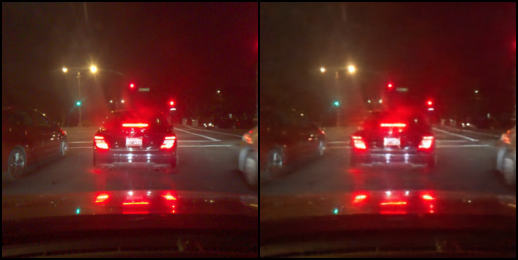
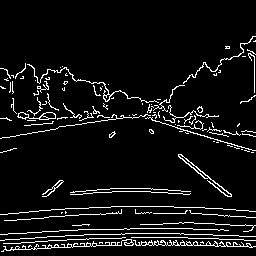
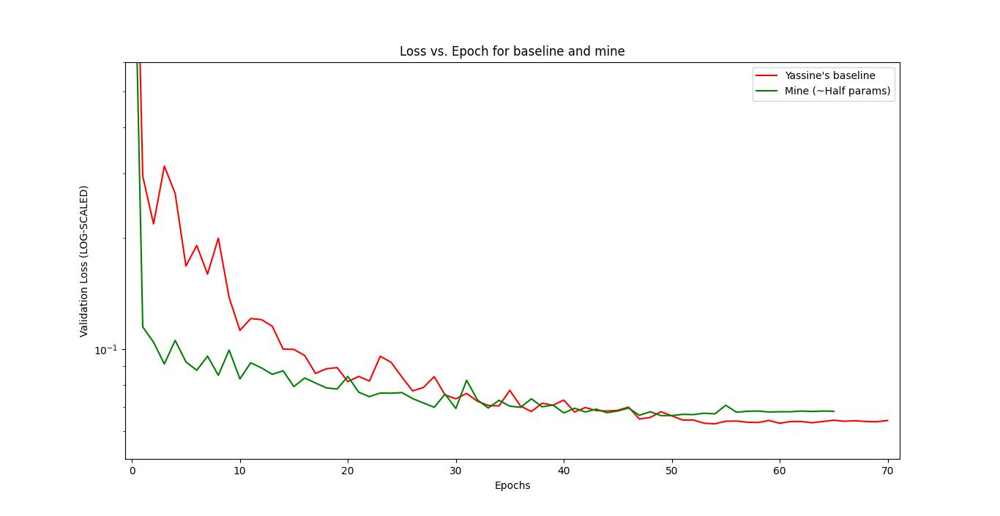

# Introduction
This is repo contains all the code I used in my various experiments exploring self-driving datasets like [Comma-10k](https://github.com/commaai/comma10k).

Notably, I used some techniques to improve computattional efficiency of the models, allowing me to catch up in performance to the Comma10k Segmentation challenge's top score using nearly **half** the parameters.

I created a subset of the official [Comma-2k19](https://github.com/commaai/comma2k19) dataset, called [Comma-200k](https://www.kaggle.com/datasets/neelg007/comma-200k) uploaded on Kaggle, with some basic filtering and preprocessing to make it easier to work with.

# Experiments

A *highly* condensed summary of my experiments:

- I trained an unsupervised [`VQ-VAE-2`](https://arxiv.org/abs/1906.00446) on Comma-200k. 

I chose a vector quantized VAE because I suspected that a discrete representation might actually help to produce a better representation that can be consumed by lightweight decoder models. Plus, these representations can be used for training transformers, such as an explicit ViT-based world model.

The goal was to use the latent representations in the future work, and build models on top of it for tasks like trajectory prediction, occupancy grid mapping, `SLAM` etc.

It works well, but didn't particularly help in Segmentation due to the hierarchial encoder not propogating enough information for fine-grained, pixel-perfect segmentation map. This is using a `32x32` quantized latent space.

<figure>

<figcaption>Left: Original Image, Right: Reconstructed Image</figcaption>
</figure>

- In another one of my experiments, I used some off-the-shelf pre-processing filters before feeding the images to the encoder (concatted) w/ a FPN (Fully-Pyramidal Network) decoder + HRNet (High Resolution Net) to preserv fine-grained features specifically for segmentation. 

I ended up using features from a `SLIC` (Simple Linear Iterative Clustering) superpixels and good ol' canny filter, and fed the concatenated features to the `HRNet + FPN` encoder.

<figure>

<figcaption>Canney Filtered Image</figcaption>
</figure>

This shows promising results. I could slash upto `50%` of the model's parameter count while still being competitive with the public baseline:

| Run | Best Validation loss | Parameters | Logs | % Difference |
| --- | ----------- | --- | --- | --- |
| Comma-10k (OG) baseline | `0.0631` | ~21M | [Yassine's Base](https://pastebin.com/1zwYGG8T) | 0% |
| Comma-10k (effnet_b3) baseline | `0.0745` | ~13.2M | [Yassine's effnetb3](https://pastebin.com/peLR4svt) | -16.5% (against OG baseline) | 
| Predator-baseline | `0.0654` | ~13.3M | [Pred_HRnet](https://pastebin.com/MkP4sRA2) | **+13%** (against `effnet_b3` baseline) |

Yielding a nearly `~45%` decrease in parameters with a (relatively) minor degradation in performance. I believe with a little hyperparameter tuning (this was only hand-tuned for a few runs due to resource constraints), I could get it to perform even better.

# Credits

Thanks to Rosinality for providing such a wonderfully easy and elegant VQ-VAE-2 [implementation](https://github.com/rosinality/vq-vae-2-pytorch), Yassine Yousfi for his well-written codebase and excellent baseline which I forked, and of course [comma.ai](https://www.comma.ai) for generously open-sourcing all the datasets used.