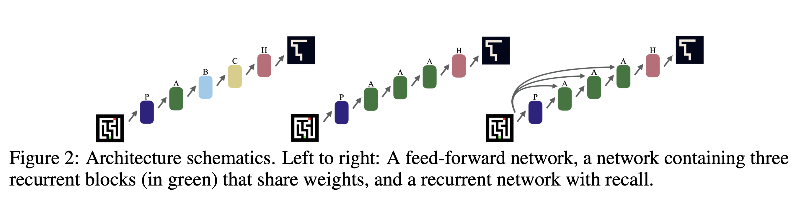
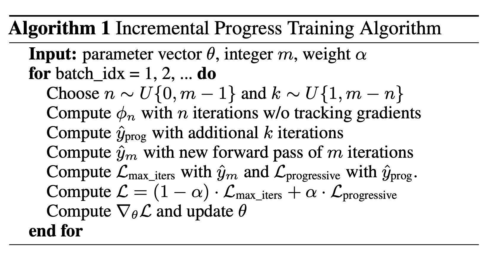
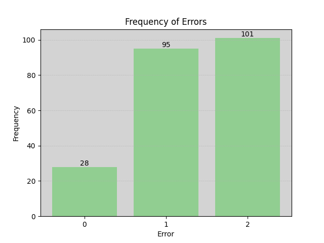
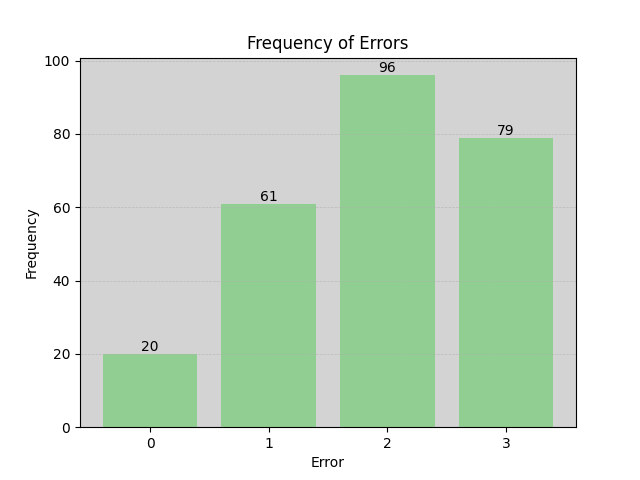
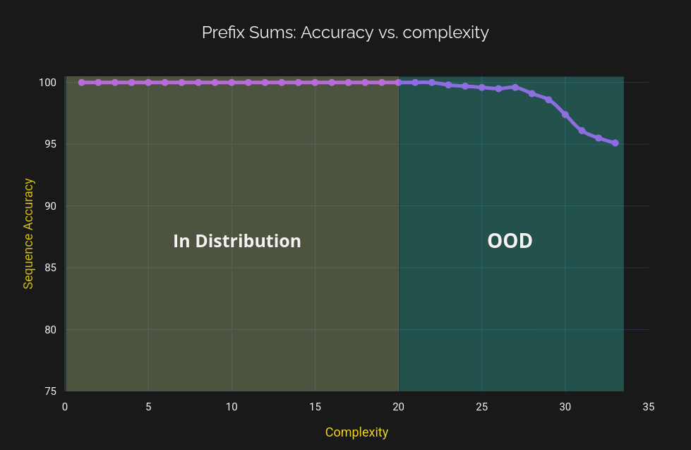
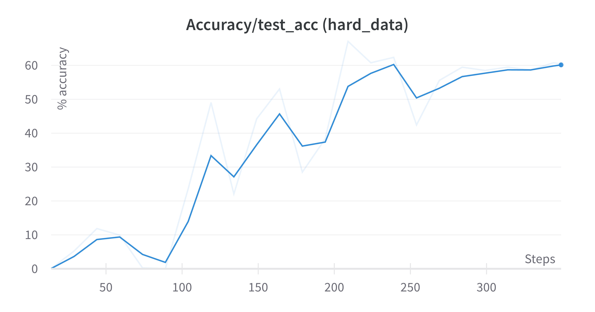
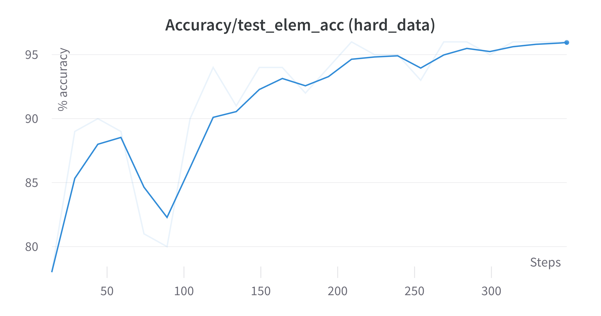

</aside>

# Abstract

OOD (Out-of-distribution) generalization has been an unsolved problem for Deep Learning. While self-attention based variants have taken great strides in being able to recover the [underlying structured representations](https://thegradient.pub/othello/) in the data, They lack a key component if they are to achieve arbitrary generalization - adaptive computation and strong priors.

This project presents preliminary results of the attempt to generalize the ideas present in prior literature to attention-based variants. We present a modified (recurrent) architecture that is both effective and parallelizable, that displays interesting properties as well as being able to OOD extrapolate on toy tasks. We believe that incorporating strong inductive biases and priors to traditional DL models may go a long way towards eventually being able to arbitrarily extrapolate.

The biggest challenge this line of approach faces is stability. As the dynamics of the task become harder, the approximation learnt by the NN has to become more stable - otherwise they risk compounding errors with more and more iterations. This report highlights some of the ideas used in prior literature to combat this as well as integrate some novel ideas to attempt in making these models maximally stable - even if we fall short of completely solving the problem.

<aside>
<b>Note:</b> Further work needs to be done to better understand the viability and scalability of this direction.

Due to financial and time constraints (I'm broke) we couldn't do thorough ablations. So take all hypotheses with a grain of salt. That said, a lot of my opinions are guided by experiments that didn't make it here - so feel free to contact me. Details are given at the end of this document.

</aside>


# Related Work

This section is a rapid-fire primer on the work done by [Bansal et al.](https://arxiv.org/abs/2202.05826) and [Kaizer et al.](https://arxiv.org/abs/1511.08228) for embedding adaptive-computational properties in recurrent styled models.

Bansal and Schwarzschild in their paper [demonstrated](https://twitter.com/arpitbansal297/status/1580922302543167488?s=20) how their architecture, dubbed "Deep Thinking Network” was able to OOD generalize, solving `201x201` sized mazes despite being only trained on `9x9` ones. The network learnt the [dead-end filling](https://en.wikipedia.org/wiki/Maze-solving_algorithm) algorithm:

<figure>
<div class="img-container">

</div>
<figcaption>A <code>DTNet</code> solving a maze</figcaption>
</figure>

This was achieved by using the **same** network and applying it multiple times iteratively. Such a formulation is similar to [DEQs (Deep-equilibrium Networks)](https://arxiv.org/abs/1909.01377), but even simpler and more scalable. This is recursively performed for a maximum bound of `max_iters: int` iterations. It is expected the the model learns to extrapolate both **iteration-wise** and **length-wise,** if it's to OOD generalize at all.

<figure>
<div class="img-container">

</div>
<figcaption>Fig 1. <code>DTNet</code> employs the same block recursively, as well as a long-skip connection called `recall`</figcaption>
</figure>

This paper however utilizes vanilla CNNs inspired from a [ResNet](https://arxiv.org/abs/1512.03385) block. While the inductive biases integrated by convolutions are helpful, they are ill-suited for arbitrary seq2seq tasks. This is where `ReAct` comes in.

<figure>
<div class="img-container">

</div>
<figcaption><code>DTNet</code> employs the same block recursively, as well as a long-skip connection called `recall`</figcaption>
</figure>

Through this simple idea, they were able to gain OOD length-extrapolation on a variety of tasks. From Maze-solving, to prefix sums and even chess!

<figure>
<div class="img-container">

</div>
<figcaption>
Fig 3. Performance of <code>DTNet</code> on several tasks.
</figcaption>
</figure>

Another issue here is that transformers simply can't handle unseen positional encodings - thus when OOD positional encodings enter the model, much like ["SolidGoldMagiKarp"](https://www.lesswrong.com/posts/aPeJE8bSo6rAFoLqg/solidgoldmagikarp-plus-prompt-generation) tokens, the circuits aren't able to handle it effectively. This has been addressed in some works, which interpolate positional encodings or use alternative positional encoding schemes (like [RoPe](https://blog.eleuther.ai/rotary-embeddings/)) but they [still fall short](https://arxiv.org/abs/2305.19466) of actually extrapolating.

We don't consider "interpolating” positional encodings to be an effective way to combat length-generalization as the model actually doesn't extrapolate - rather we adjust the inputs to be in-distribution which can be a brittle process. `ReAct` on the other hand uses vanilla sinusoidal embedding and can still lenght-extrapolate. This, length extrapolation can be achieved through inductive biases/priors alone instead of resorting to unholy tricks.

# Architecture


<figure>
<div class="img-container">

</div>
<figcaption>
Fig 4. Diagram of <code>ReAct</code>. Here, <code>+</code> denotes vector addition, and the arrows (<code>--></code>) represent the flow of information through the various modules
</figcaption>
</figure>

`ReAct` is heavily inspired from `DTNet` in its bid to integrate attention into the architecture and operate on arbitrary seq2seq tasks. This is useful as its makes the model flexible to various tasks. The architecture is kept simple to aid in scalability, following from ["The Bitter Lesson”](http://www.incompleteideas.net/IncIdeas/BitterLesson.html)

While the original ideas was envisioned as a short weekend project to swap out the `nn.Conv1d` layers to `nn.MultiHeadAttention` layers, more techniques and tricks were required to get it to work. There were some interesting results - such as self-attention being next-to-useless as well as the model being resistant to overfitting/memorisation. I will elaborate on those changes below.

# A Lighter Attention - `LiteAttention`

One of the most counterintuitive findings of this (short) project was how **ineffective** Multi-head self-attention is, especially for OOD generalization. The problem with MHSA is simple - ***it works too well!***

MHSA simply can't length-extrapolate. The circuits it learns are hardcoded to the length of the outputs it has seen during training. As a result, if for example the task is `reverse_string` on an OOD input:

```py
# In distribution:
    [1, 2, 3, 0, 0, 0 ...]  ==> [..0, 0, 0, 3, 2, 1]

# Out of distribution
    [1, 2, 3, 4, 0, 0, ...] ==> [..0, 0, 3, 2, 1]
```

The model simply learns to ignore that OOD token position. This is well studied, and is believed to be because of the sinusoidal positional encodings.

To remedy this, we opted to use a simplified version of “Attention” that acts closer to an information gate. Because its simpler, we suspected it wouldn't learn to be too overly reliant on spurious features and help towards generalization.

<figure>
<div class="img-container">

</div>
<figcaption>
Fig 5. The entire (yes entire) torch code for the `LiteAttention` layer. The dimension of the softmax is adjustable, but the default is never overriden because its a seq2seq task.
</figcaption>
</figure>

The main benefit of using `LiteAttention` is that it works as a more explicit information gating mechanism, handles OOD sinusoidal embeddings well and doesn't require any other heavy modifications - such as using an explicit decay mechanism like [AliBi](https://arxiv.org/abs/2108.12409).

As explained, `LiteAttention` simply replaces the *matmul* used in `SelfAttention` with a hadamard product. We use `Softmax` to bound the final attention scores, which are derived from a simple `Linear` layer to create data-dependency for (hopefully) acting as a diluted proxy to In-context learn.

I doubt `LiteAttention` holds up with scale. Because it was intended to explicitly remove a *matmul,* there is little inter-token information mixing. It's closer to a gate used in RNNs. However, it's able to (surprisingly) hold up towards rather complicated tasks given its simplicity. I suspect adding the data-dependency is what makes it so expressive

# Implicit error correction using `n+k`

`n+k` sampling refers to how we handle the training loop. Because we have a recurrent architecutre, we want to encourage the model to learn an error-correcting mechanism. The basic idea is simple: 

- We run the model for `n` times while throwing away the gradients. `n` is sampled s.t `n ≤ max_iters` 

- Then, run the model for `k` iterations which will be backpropagated to improve on the last `n` iterations. This technique helps the model to be somewhat stable and converge to and equilibrium. `k` is sampled s.t `k ≤ max_iters - n`

This loss is interpolated with the standard loss which just runs the model for `max_iters` determined by $\alpha$, the interpolation co-efficient.

The actual `torch` code used:

<figure>
<div class="img-container">

</div>
<figcaption>
Fig 6. code for <code>n+k</code> loop. Adversarial perturbation actually modifies it - see below sections for more details
</figcaption>
</figure>

This code however has a subtle bug: notice that both $n \sim U(0, \\text{max\\_iters})$ and $k \sim U(1, \\text{max\\_iters} - n + 1)$. The sum of 2 randomly drawn variables from a uniform distribution is **NOT** uniform - rather its **Gaussian.** And because of our bounds, its resembled the truncated half of the gaussian:

<figure>
<div class="img-container">

</div>
<figcaption>
Fig 7. Frequency plot of the distribution of <code>n+k</code> for <code>max_iters = 10</code>
</figcaption>
</figure>

To fix this, in practice we weigh the loss to roughly fit the distribution and compensate for it.

<figure>
<div class="img-container">

</div>
<figcaption>
Fig 8. Weighing the loss exponentially (with <code>base-2</code>) to approximate the frequency distr. and compensate
</figcaption>
</figure>

This is a hack. If someone has a better way to do this, please give me a DM. My contact details will be below.

## Recall

The `recall` mechanism introduced by [*Kaiser et al.*](https://arxiv.org/abs/1511.08228) is a simple modification. As indicated in (**Figure 4**), it's a long skip connection which helps in the "Overthinking” problem. i.e, even if you perform more iterations that necessary, the model is able to recover the accuracy and not deviate too much.

That's because there are no explicit constraint put on the architecture to be Lyapunov stable. However, due to the `n + k` training loop, SGD learns to (approximately) be somewhat stable and converge to equilibrium. This may need to be reinforced for future work, but for these tasks it's adequate.

<figure>
<div class="img-container">

</div>
<figcaption>
Fig 8. The <em>recall</em> mechanism provides stability to the model.
</figcaption>
</figure>

In code, this long skip connection is represented as a `concat` op. `x: torch.Tensor` is the tensor obtained after `embed`-ing and adding positional encodings to the `input_sequence`. This is highlighted in code below:

<figure>
<div class="img-container">

</div>
<figcaption>
Fig 9. Loop executed for 1 forward pass to perform <code>iters_to_do</code> iterations
</figcaption>
</figure>

# Adversarial Perturbation

In an attempt to guide the model towards learning a more explicit error correction methodology and aid the `n + k` training loop, we introduce *"*Adversarial Perturbation”. Effectively, when we iterate the `recur_block,` we get an intermediate representation which is passed to the next iteration. That iteration is termed `interim_thought`.

The "output_sequence” is obtained when we apply the `output_head(interim_thought)`, and `.softmax().argmax(dim=-1)` the logits.

However, we want to introduce mild errors in the final decoded sequence - such that the sequence is off by a few bits and the model learns to correct errors arising due to corrupted bits.

So the task becomes:

> Find the smallest perturbation to `interim_thought` such that the decoded sequence,`output_head(interim_thought).softmax().argmax()` has the few corrupted bits that we desire.

This `perturbed_thought` is now fed back into the model for a few more iterations (slightly transgressing the upper bound of `max_iters`) so that the model is forced to locate and correct the errors.

This can be accomplished through a number of ways. We chose to run a smaller loop were we:

1. Obtain the vanilla decoded `output_sequence` and then corrupt it.
2. Take the corrupted sequence as the targets and make `interim_thought` trainable. These would be the parameters, and `out_head` should remain static/untrainable.
3. Backprop using an adaptive optimizer (`AdamW`) and update for a few steps.

Now because we're running very few steps ($\leq10$) and a small-ish learning rate, we **won't** converge to our target representation. Nevertheless, in the process of gradient descent, errors would still creep in as it tries to converge to the corrupted version. We however terminate the convergence early bceause we don't care **where** the errors are - just their number.

This is important for performance. Using this, a corruption of a batch of $300$ samples takes about $\sim 150\text{ms}$ on a T4. This is still a pretty heavy hit, but for the scales we're operating at - it is next-to-nothing.

The entire code can be found [here](https://github.com/neel04/ReAct/blob/82b72f0ba40afbe447447846d4973805ba77ef82/deep-thinking/deepthinking/utils/corrupter.py#L8). A simplified snippet is attached below:

<figure>
<div class="img-container">

</div>
<figcaption>
Fig 10. Simplified snippet of the loop that skips the backprop steps and the logging. Hyperparameters were chosen mostly arbitrarily and were found to work decently well
</figcaption>
</figure>

And here is a sample of few of the distributions generated during training, as reported in the WandB. This is for $n = 2$ and $n=4$ respectively. These are the distribution of errors on single **batch** of sequences as handled by the model. Due to the stochastic nature of the process, the distribution fluctuates around quite a bit:

<figure>
<div class="img-container">

<div>
<figcaption>
Fig 11. Distribution of errors on a batch of sequences. <code> n = 2</code>
</figcaption>
</figure>


<figure>
<div class="img-container">

</div>
<figcaption>
Fig 12. Distribution of errors on a batch of sequences. <code> n = 4</code>
</figcaption>
</figure>

<aside>
<b>NOTE:</b> Adversarial perturbation is required only for complex tasks such as <code>bAdd</code> (binary addition). It isn't needed for simpler tasks like <code>prefix_sums</code> and <code>reverse string</code>

</aside>

## Curriculum Learning

We also utilise simple curriculum learning - the length/complexity of the input sequence is ramped up. We start off with some length defined by `lower_b` and slowly increment it until its equal to `upper_b`. Increments happen when the model is able to achieve an element accuracy of $\geq 98\%$ on the current curriculum.

We have found that adding this basic curriculum helps in generalization though its not strictly needed.

## Positional encoding

As mentioned before, this architecture uses simple sinusoidal positional encodings - which is highly unusual, considering other methods have to often work around them.

<figure>
<div class="img-container">

</div>
<figcaption>
Fig 11. Snippet to calculate positional encoding
</figcaption>
</figure>

`ReAct` demonstrates that you do not need to specifically engineer your positional encodings for extrapolation.

Somewhat surprisingly, the network is actually **worse** when provided alternative positional encodings.

- `RoPe` performs terribly - It fails to generalize at all. The code used could easily be suspect - I used [lucidrains'](https://github.com/lucidrains/rotary-embedding-torch) repo which did have a bugfix recently so perhaps its worth to re-run that experiment.
- `AliBi` too has its own problems. It has been empirically shown [not to help in length generalization](https://arxiv.org/abs/2305.19466). Its a hacky way that's often hit-or-miss. For my experiments, it seems to help self-attention a little but `LiteAttention` performs much better with sinusoidal embeddings.
- `NoPe` (No PE) predictably makes it almost impossible for the network to converge. The loss occasionally dips towards convergence, but its too slow. Translational invariance is not a desirable property for any of the tasks tested.

---

# Results

I tested on 3 tasks: `prefix_sums`, `reverse_string` and `binary_addition`.

## Prefix Sums

Prefix sums are a kinda of rolling parity, where at each index of the target sequence you evaluate the parity of all the elements from the source sequence proceeding that index. For researchers familiar with MI, this is similar to the [tracr-xproportion](https://arxiv.org/pdf/2301.05062.pdf) task, except with parity 🙂

To give a concrete example:

```python
src: 1 0 0 1 1

tgt[0] = parity(1) = 1
tgt[1] = parity(1, 0) = 1
tgt[2] = parity(1, 0, 0) = 1
tgt[3] = parity(1, 0, 0, 1) = 0
tgt[4] = parity(1, 0, 0, 1, 1) = 1

Therefore: tgt: 1 1 1 0 1
```

I chose this as vanilla parity is too simple - prefix sums forces the model to learn a more complex algorithm and actually maintain a counter.

<figure>
<div class="img-container">

</div>
<figcaption>
Fig 12. Graph for the <strong>sequence accuracy</strong> of the model w.r.t the complexity (In this case, the length) of the sequence
</figcaption>
</figure>

Here, the model is able to hold its own when in OOD regime. Compared to transformers, which can't extrapolate more than a few bits on any task unless:

1. Augmented via teaching the task ICL. Which while demonstrates ICL abilities, is largely redundant as it requires human-intervention.

2. Scratchpad/CoT: Does not guarantee [OOD generalization.](https://arxiv.org/abs/2305.19466)

3. Utilizing fancy positional encoding and interpolating between them - or using no positional encoding which yields a computational hit.

But the core problem is the lack of an ACT mechanism - which gurantees that for most tasks, OOD generalization is next to impossible if the computation required grows monotonic. While `ReAct` is a rough attempt for integrating such a mechanism, more work needs to be done to be able to scale it well and beyond.

<figure>
<div class="img-container">

</div>
<figcaption>
Fig 13. Again, standard transformers show 0 ability to generalize OOD. <code>ReAct</code> on the other hand is able to extrapolate well.
</figcaption>
</figure>

## Reverse string

<figure>
<div class="img-container">

</div>
</figure>

As the name implies, this tasks requires the model to learn to recognize every token and build up an intermediate memory which is updated every iteration, as well as recognising where the sequence ends and starts.

Here, you can see the model is able to extrapolate both **iteration-wise** and **length-wise** which are both important properties if one wishes to scale this architecture to harder tasks.

I believe the perfect extrapolation ($100\%$ sequence accuracy) is due to the dynamics of the task being relatively simpler - as compared to "harder” tasks like binary addition which suffers from some accumulating errors.

## Binary Addition

Here, `ReAct` successfully extrapolate 2 digits OOD that is the validation set. However, after 5 digits OOD we start seeing a problem:

<figure>
<div class="img-container">

</div>
</figure>

The highest "Sequence Accuracy” (whole string match) is about $67\%$. On the other hand, the elementwise accuracy on the test set reveals the full picture:

<figure>
<div class="img-container">

</div>
</figure>

Where it achieves $96\%$ elemwise accuracy. 

# Limitations

This reveals a problem - when the dynamics of a task get too complex, then it becomes harder for the network to correct errors. This can affect its ability to generalize arbitrarily both iteration-wise and complexity-wise. While the performance here still far outperforms the generalization capabilities of vanilla transformers, that's a low bar.

So how can we fix this?

One method is to add an explicit mechanism to encourage SGD to perform error correction. But I personally prefer being implicit than explicit.

**HYPOTHESIS**: The error correction mechanism introduced by "Adversarial Perturbation” works. However, during training because we obey the bound of `max_iters`, this causes extrapolation problems: because we're working in continuous space, errors are bound to occur. But `AdamW` won't learn to correct those errors as the error-correction mechanism it learns works only for in-distribution iteration `<= max_iters`.

One method to fix this is to use something like “iteration-priming”. Basically, for some probability `p: float` we forced the model to use an `n ≥ max_iters` . Because we don't backprop here (that's for `k`) and its applied to a small `p` fraction of samples, we incur minimal computational cost while forcing `AdamW` to learn an error correction mechanism that actually generalizes to more iterations than simply the upper-bound `max_iters`

However, as always, actual testing and experimentation needs to be done here 🙂 "Talk is cheap, results are hard"…

# Credits

A lot of credit goes to Avi Schwarzschild and Arpit Bansal whose work this project is based upon. The code I used is directly derived from their amazing repository - you can check it out [here!](https://github.com/aks2203/deep-thinking)

This project was supported by [Algovera.ai](http://Algovera.ai). Huge shoutout to all the help they've provided in the form of a micro-grant. I hope they continue sponsoring projects like these for the future.

---

[***This is the original Notion post.***](https://www.notion.so/ReAct-78280ae0ba984217aed117d3be147e2b?pvs=21)